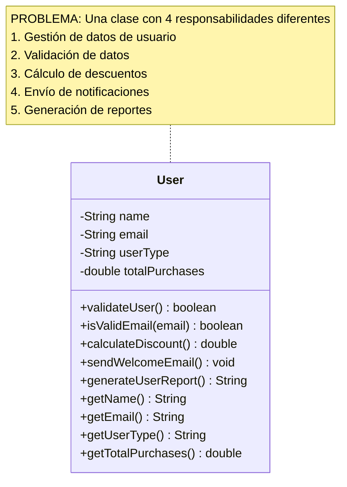
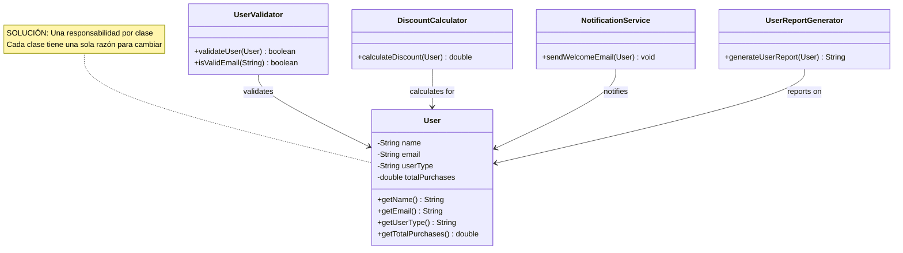
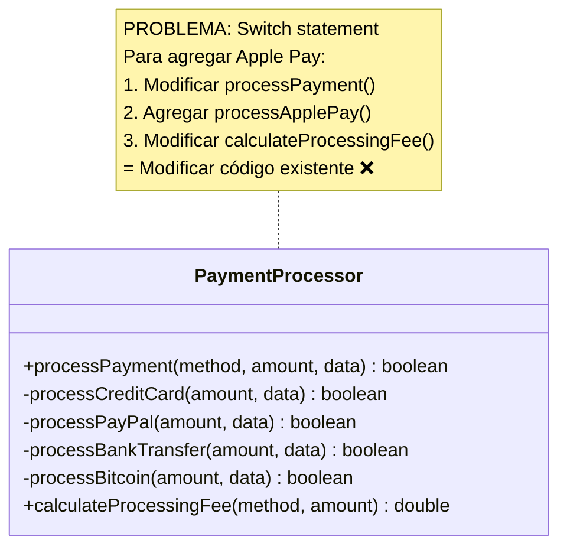
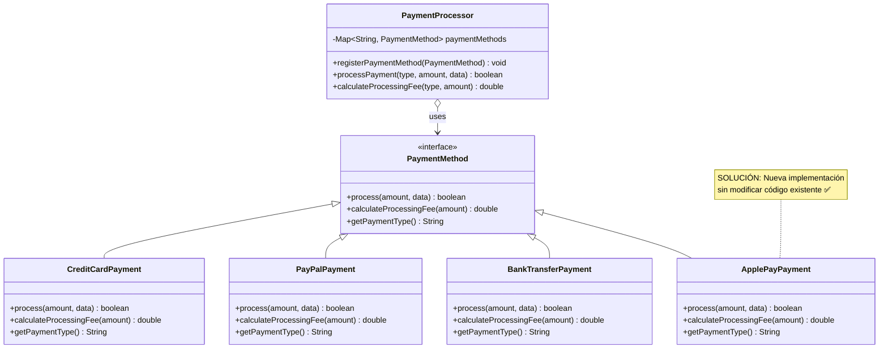
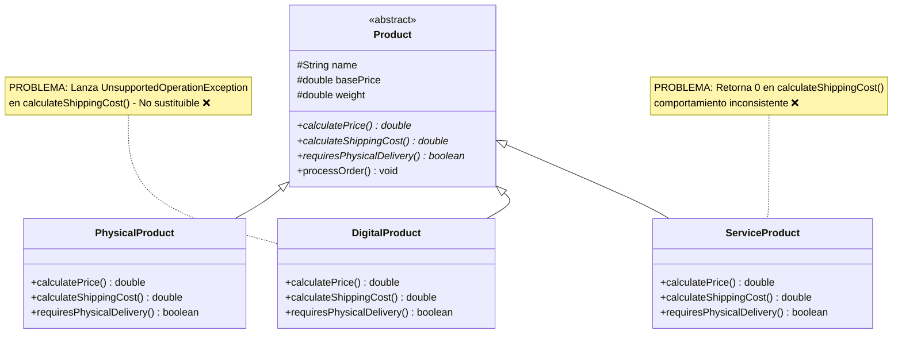
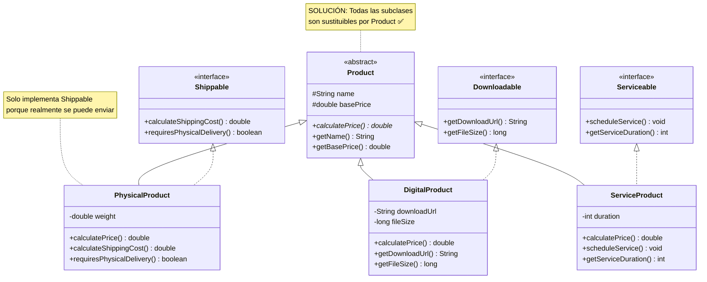
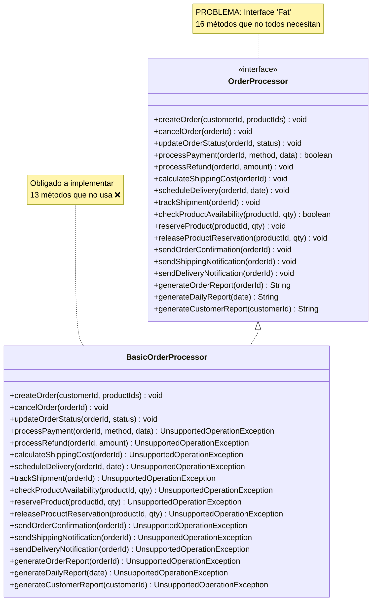
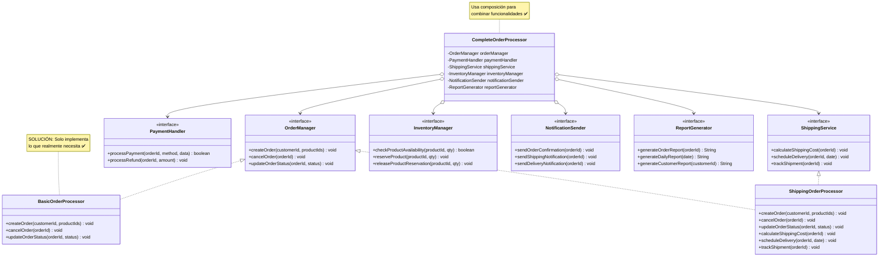
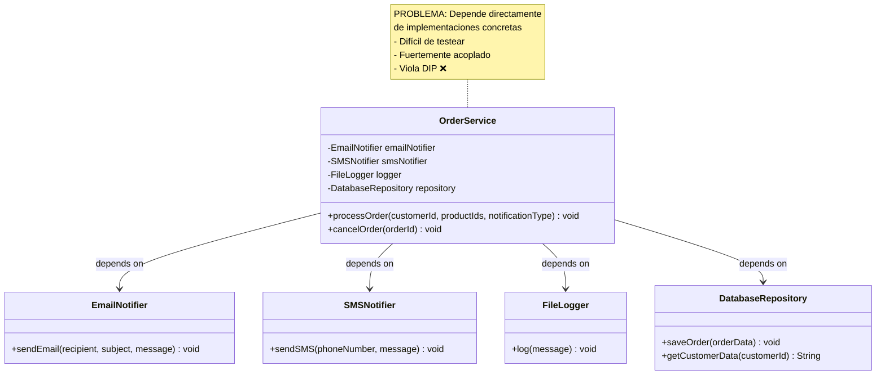
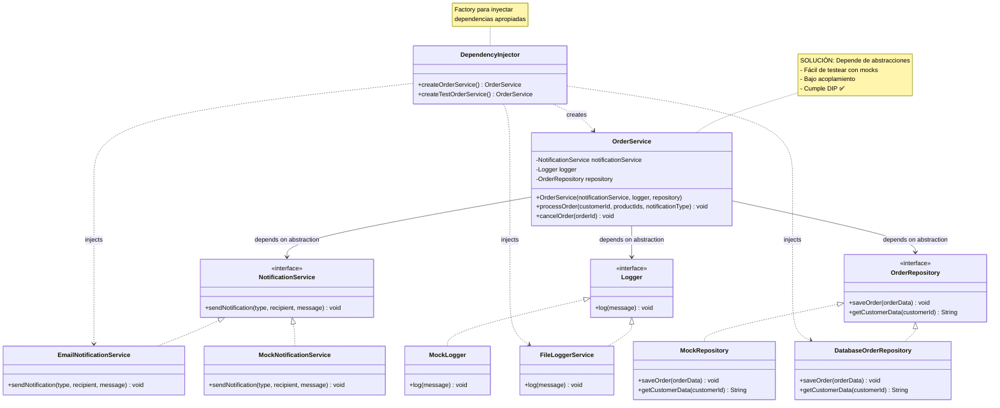

# Laboratorio 02: Violación de Principios SOLID

- **Curso**: Ingeniería de Software II
- **Aula**: 851
- **Fecha**: 26/08/2025
- **Jefe de prácticas**: Sebastián Chávarry

---

## Caso de Estudio: Sistema de E-Commerce

Una empresa está desarrollando un sistema de e-commerce que maneja productos, usuarios, pedidos y pagos. El sistema actual presenta múltiples violaciones a los principios SOLID que afectan su mantenibilidad, escalabilidad y testabilidad.

### Contexto del Sistema:

- **Gestión de productos:** Diferentes tipos de productos (físicos, digitales, servicios)
- **Procesamiento de pedidos:** Cálculo de precios, aplicación de descuentos, envío
- **Sistema de pagos:** Múltiples métodos de pago (tarjeta, PayPal, transferencia)
- **Notificaciones:** Email, SMS, push notifications
- **Reportes:** Diferentes formatos de reportes de ventas

> **Objetivo**: Identificar, analizar y corregir violaciones a los principios SOLID en un sistema real

---

## Preparación del Proyecto

1. Crear un nuevo proyecto Maven llamado `SolidViolationsLab`
2. Configurar la estructura de paquetes:
   - `com.solid.violations` - Clases con violaciones
   - `com.solid.corrected` - Clases corregidas
   - `com.solid.tests` - Clases de prueba

---

## Ejercicio 1: Violación del Principio SRP (Single Responsibility Principle)

### Descripción del Problema:

La clase `User` tiene múltiples responsabilidades que deberían estar separadas:

- Validación de datos de usuario
- Cálculo de descuentos según tipo de usuario
- Envío de notificaciones de bienvenida
- Generación de reportes de usuario

### Diagrama del Problema (Violación SRP):



### Diagrama de la Solución (Cumple SRP):



### Indicaciones:

1. **Identifica** las violaciones al principio SRP en la clase `User` proporcionada
2. **Analiza** por qué cada responsabilidad debería estar en una clase separada
3. **Refactoriza** el código separando las responsabilidades en clases apropiadas
4. **Crea** las siguientes clases en el paquete `com.solid.corrected`:
   - `User` - solo datos del usuario y getters/setters
   - `UserValidator` - responsable de validar datos de usuario
   - `DiscountCalculator` - responsable de calcular descuentos por tipo de usuario
   - `NotificationService` - responsable de enviar notificaciones
   - `UserReportGenerator` - responsable de generar reportes de usuario

### Preguntas Guía:

- ¿Cuántas razones tiene la clase `User` para cambiar?
- ¿Qué responsabilidades no deberían estar en la clase `User`?
- ¿Cómo mejora la separación la testabilidad del código?

---

## Ejercicio 2: Violación del Principio OCP (Open/Closed Principle)

### Descripción del Problema:

La clase `PaymentProcessor` usa un `switch` statement que requiere modificación cada vez que se agrega un nuevo método de pago. Esto viola el principio OCP porque la clase no está cerrada para modificación.

### Diagrama del Problema (Violación OCP):



### Diagrama de la Solución (Cumple OCP):



### Análisis de la Violación:

- Cada nuevo método de pago requiere **modificar** el `switch` statement existente
- Se deben agregar nuevos métodos privados a la clase existente
- El método `calculateProcessingFee()` también debe ser modificado
- No hay forma de **extender** funcionalidad sin **modificar** código existente

### Indicaciones:

1. **Explica** detalladamente por qué el `switch` statement viola el principio OCP
2. **Diseña** una solución usando el patrón Strategy con interfaces y polimorfismo
3. **Implementa** en el paquete `com.solid.corrected`:
   - Interface `PaymentMethod` con métodos `process()`, `calculateFee()` y `getPaymentType()`
   - Clases concretas: `CreditCardPayment`, `PayPalPayment`, `BankTransferPayment`, `BitcoinPayment`
   - Nueva clase `PaymentProcessor` que use un Map/Registry para almacenar métodos de pago
   - Clase `ApplePayPayment` para demostrar extensión **SIN modificar código existente**

### Preguntas Guía:

- ¿Qué código debe modificarse para agregar un nuevo método de pago en la versión original?
- ¿Cómo permite la nueva solución agregar métodos de pago sin modificar código existente?
- ¿Qué beneficios adicionales ofrece esta aproximación para testing?

---

## Ejercicio 3: Violación del Principio LSP (Liskov Substitution Principle)

### Descripción del Problema:

En la jerarquía de productos, las subclases `DigitalProduct` y `ServiceProduct` no pueden sustituir completamente a su clase base `Product` porque:

- `DigitalProduct.calculateShippingCost()` lanza una excepción
- `ServiceProduct.calculateShippingCost()` retorna 0 (comportamiento inconsistente)
- El método `processOrder()` falla cuando se usa polimorfismo

### Diagrama del Problema (Violación LSP):



### Diagrama de la Solución (Cumple LSP):



### Indicaciones:

1. **Explica** por qué se viola el principio LSP con ejemplos específicos
2. **Identifica** los problemas de sustituibilidad en el código de prueba
3. **Rediseña** la jerarquía de clases para que todas las subclases sean completamente sustituibles
4. **Implementa** en el paquete `com.solid.corrected` una solución que puede incluir:
   - Separación de interfaces (`Shippable`, `Downloadable`, `Serviceable`)
   - Uso de composición en lugar de herencia forzada
   - Redefinición de la jerarquía de clases con contratos apropiados
   - Implementación del patrón Strategy para comportamientos específicos

### Preguntas Guía:

- ¿Qué comportamientos específicos no aplican a todos los tipos de productos?
- ¿Cómo puede la composición resolver los problemas de herencia?
- ¿Qué interfaces deberían definirse para diferentes capacidades de productos?

---

## Ejercicio 4: Violación del Principio ISP (Interface Segregation Principle)

### Descripción del Problema:

La interface `OrderProcessor` es una "fat interface" que fuerza a las implementaciones a depender de métodos que no necesitan, causando que muchos métodos lancen `UnsupportedOperationException`.

### Diagrama del Problema (Violación ISP):



### Diagrama de la Solución (Cumple ISP):



### Indicaciones:

1. **Identifica** por qué la interface `OrderProcessor` viola el principio ISP
2. **Analiza** qué problemas causa forzar implementaciones innecesarias
3. **Diseña** interfaces más pequeñas y específicas basadas en responsabilidades
4. **Implementa** en el paquete `com.solid.corrected`:
   - Interfaces segregadas: `OrderManager`, `PaymentHandler`, `ShippingService`, `InventoryManager`, `NotificationSender`, `ReportGenerator`
   - Clase `BasicOrderProcessor` que implemente solo `OrderManager`
   - Clase `ShippingOrderProcessor` que implemente `OrderManager` y `ShippingService`
   - Clase `CompleteOrderProcessor` que combine múltiples interfaces usando composición
   - Demuestra cómo las clases ahora solo dependen de lo que realmente necesitan

### Preguntas Guía:

- ¿Cuántas responsabilidades diferentes tiene la interface original?
- ¿Qué clases realmente necesitan cada grupo de métodos?
- ¿Cómo mejora la segregación la flexibilidad y mantenibilidad?

---

## Ejercicio 5: Violación del Principio DIP (Dependency Inversion Principle)

### Descripción del Problema:

La clase `OrderService` (alto nivel) depende directamente de implementaciones concretas de bajo nivel:

- Instancia directamente `EmailNotifier`, `SMSNotifier`, `FileLogger`, `DatabaseRepository`
- Está fuertemente acoplada a implementaciones específicas
- Es muy difícil de testear porque hace operaciones reales (archivos, emails, BD)
- Cualquier cambio en las dependencias requiere modificar `OrderService`

### Diagrama del Problema (Violación DIP):



### Diagrama de la Solución (Cumple DIP):



### Indicaciones:

1. **Explica** cómo la clase `OrderService` viola el principio DIP con ejemplos específicos
2. **Identifica** los problemas de acoplamiento fuerte y dificultades de testing
3. **Diseña** una solución usando inyección de dependencias e inversión de control
4. **Implementa** en el paquete `com.solid.corrected`:
   - Interfaces para las dependencias: `NotificationService`, `Logger`, `OrderRepository`
   - Implementaciones concretas: `EmailNotificationService`, `FileLoggerService`, `DatabaseOrderRepository`
   - Implementaciones mock para testing: `MockNotificationService`, `MockLogger`, `MockRepository`
   - Nueva clase `OrderService` que reciba dependencias por constructor
   - Factory o configurador para inyectar dependencias
   - Clase de prueba que demuestre testing con mocks

### Preguntas Guía:

- ¿Qué problemas causa la dependencia directa de implementaciones concretas?
- ¿Cómo facilita la inyección de dependencias el testing?
- ¿Qué patrones de diseño ayudan a implementar DIP correctamente?

---

## Clase de Demostración

Crear `SolidViolationsDemo.java` en el paquete `com.solid.tests` que:

1. **Demuestre cada violación** ejecutando el código problemático
2. **Muestre los errores/problemas** que causan las violaciones
3. **Execute las versiones corregidas** mostrando cómo se resuelven los problemas
4. **Compare** las diferencias entre antes y después

### Estructura sugerida:

```java
public class SolidViolationsDemo {
    public static void main(String[] args) {
        demonstrateSRPViolation();
        demonstrateOCPViolation();
        demonstrateLSPViolation();
        demonstrateISPViolation();
        demonstrateDIPViolation();
    }
    // ... métodos de demostración
}
```

---

## Conceptos Clave Revisados

- **SRP**: Una clase debe tener una sola razón para cambiar
- **OCP**: Abierto para extensión, cerrado para modificación
- **LSP**: Las subclases deben ser sustituibles por sus clases base
- **ISP**: Los clientes no deben depender de interfaces que no usan
- **DIP**: Depender de abstracciones, no de implementaciones concretas

---

_Recuerda: Los principios SOLID no son reglas absolutas, sino guías para escribir código más mantenible, extensible y testeable._
